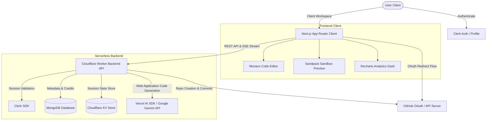

# WebCraft: An AI-Enabled Framework for Web-Based Software Synthesis

<div align="center">
  
  **A Minor Project**  
  *Submitted in partial fulfillment of the requirements for the degree of*  
  **BACHELOR OF SCIENCE IN COMPUTER SCIENCE**

  ***

  ### **Submitted By**
  **Zaheer Patel**  
  *Enrollment No: SC23CS302039*

  ### **Under the Guidance of**
  **Dr. Rohit Gupta** & **Dr. Shrikant Telang**

  ***

  [](https://nextjs.org/)
  [](https://hono.dev/)
  [](https://clerk.dev/)
  [](https://www.mongodb.com/)

</div>

---

## 📌 Abstract
In the modern digital era, websites and landing pages of businesses need engaging, creative, personalized, and modern aesthetics to attract and retain customers. However, traditional website development is time-consuming, requires expertise in programming or coding, and lacks integration with modern AI technologies. To address these challenges, this project titled **“WebCraft: An AI-Enabled framework for web-based Software Synthesis”** presents an intelligent solution that automates the generation of websites using artificial intelligence through a single detailed prompt.

The system is designed as a full-stack web application built using the modern web stack (Next.js, Cloudflare Workers, Hono, and MongoDB). It enables users to generate web apps or websites such as a ToDo List, website clones, or blogs by simply providing a text prompt. The application integrates with the Google Gemini API and Vercel AI SDK to produce high-quality, attractive UI/UX, and creative outputs in real-time.

The platform includes secure user authentication using Clerk, ensuring that only authorized users can access the system. It also provides features such as content history management, allowing users to view, reuse, and manage their previously generated projects through a personalized dashboard. The backend system efficiently handles API communication, input validation, error handling, file parsing, output parsing, and database operations, while the frontend provides a responsive and user-friendly interface.

Furthermore, the system ensures performance efficiency by generating outputs within a short time and maintaining data integrity using MongoDB. The modular architecture of the application enhances scalability, maintainability, and future extensibility. This project significantly reduces the effort and time required for website development, improves productivity, and enables users with minimal technical knowledge to generate professional and high-quality websites.

---

## 🚀 End-to-End System Architecture



---

## ✨ Core Features & Pages Walkthrough

### 1. Clerk Authentication & Session Security
* **Authentication Forms**: Premium dark-themed, glassmorphic login and sign-up pages powered by Clerk. Supports multi-factor sessions and secure login redirects.
* **Account Settings**: A dedicated `/settings` tab displaying the Clerk `<UserProfile />` themed natively with `@clerk/themes/dark`. Users can manage active sessions, security keys, and profile metadata.

### 2. Interactive Workspace Projects Dashboard
* **Workspace Management**: View, search, create, rename, and delete generated project sandboxes.
* **Credits Tracking Widget**: A sidebar floating widget that dynamically queries `/api/credits` in real-time:
  * **Free Tier**: Displays a visual gradient progress bar representing remaining credits (out of 50) and a hover upgrade button.
  * **Pro Tier**: Displays a glassmorphic violet banner with an infinity sign (`∞`) and active plan tags.

### 3. High-Fidelity Multi-Panel Project Editor
The core editor page (`/project/[projectId]`) consists of three responsive, synchronized panels:
* **Left Panel - Conversational AI Assistant**:
  * Seamless SSE (Server-Sent Events) streaming chat interface.
  * **File Tagging Autocomplete**: Typing `#` opens a floating drop-down list of all files in the project. Selecting `#codebase` or specific files attaches their exact content as XML tags (`<file_content path="...">`) into the LLM system prompt.
  * **Fix Error with AI**: If the compiler encounters an error, a single click automatically diagnostic-analyzes the workspace file structure to repair code defects.
* **Center Panel - Monaco Code Editor**:
  * Real-time multi-file tree structure explorer.
  * Monaco-powered code editor with syntax highlighting, automatic tab formatting, and file-saving states.
* **Right Panel - Interactive Sandbox Preview**:
  * Secure virtual browser container powered by `@codesandbox/sandpack-react`.
  * **Runtime Env Injection**: Automatically parses environment variables in `.env` and `.env.local` files inside the sandbox and injects them under a `window.process.env` script block inside the preview template header.

### 4. Production Ready Export Configurations
* **Dynamic ZIP Downloader**:
  * Compiles the entire project structure in a single click.
  * Automatically detects if `public/index.html` or `tsconfig.json` are missing. If so, it dynamically injects them alongside Tailwind CSS CDNs and parsed environment variable scripts to guarantee out-of-the-box local execution (`npm install` -> `npm run dev`).
* **Custom GitHub OAuth Flow**:
  * Replaces insecure manual tokens with a secure, native GitHub OAuth flow.
  * **Smart State Context Retention**: Clicking "Connect GitHub" redirects the user to GitHub. The auth callback page (`/auth/github/callback`) completes the code exchange, updates backend state, and returns the user **directly back** to their active editor page so work is never lost.
  * **Push to GitHub**: When connected, users can input a repository name, configure privacy (Public/Private), and commit files to GitHub in seconds.

### 5. Recharts Analytics Dashboard
* **Dynamic Visualization Page (`/analytics`)**:
  * **Stats Summaries**: Displays total projects, generations count, used credits, and avg versions.
  * **Timeline Velocity**: Interactive Area/Line charts showing generation frequency trends.
  * **Model Distribution**: Interactive Pie chart showing the usage ratio of models.
  * **Activity Log**: Scrollable table showing recent generation history with prompts and file sizes.

---

## 🛠️ Installation & Environment Setup

The application is split into two components: the **Frontend client** (located in the repository root directory) and the **Backend worker API** (located in the `worker/` subdirectory).

### 1. Prerequisites
* **Node.js**: Version `20.x` or higher installed.
* **MongoDB**: A running instance of MongoDB Community Server locally (on port `27017`) or a connection URI from MongoDB Atlas.
* **Clerk Developer Account**: To configure user session management.
* **GitHub Account**: To create an OAuth application client.

### 2. Frontend Configuration
In the repository root folder, create a file named `.env.local` and add:

```env
# Clerk Authentication Configuration (From Clerk Dashboard > API Keys)
NEXT_PUBLIC_CLERK_PUBLISHABLE_KEY=pk_test_...
CLERK_SECRET_KEY=sk_test_...

# Clerk Auth Endpoint Paths
NEXT_PUBLIC_CLERK_SIGN_IN_URL=/sign-in
NEXT_PUBLIC_CLERK_SIGN_UP_URL=/sign-up
NEXT_PUBLIC_CLERK_SIGN_IN_FALLBACK_REDIRECT_URL=/dashboard
NEXT_PUBLIC_CLERK_SIGN_UP_FALLBACK_REDIRECT_URL=/dashboard

# Backend API Endpoint
NEXT_PUBLIC_WORKER_URL=http://localhost:8787

# GitHub OAuth Application Client ID
NEXT_PUBLIC_GITHUB_CLIENT_ID=your_github_oauth_client_id
```

### 3. Backend Worker Configuration
In the `worker/` directory, create a file named `.dev.vars` (used for local environment secrets) and add:

```env
# Clerk Token Verification (From Clerk Dashboard > API Keys > JWKS URL)
CLERK_JWKS_URL=https://your-clerk-subdomain.clerk.accounts.dev/.well-known/jwks.json
CLERK_ISSUER=https://your-clerk-subdomain.clerk.accounts.dev

# AI Provider API Keys
GOOGLE_AI_API_KEY=AIzaSy...
ANTHROPIC_API_KEY=sk-ant-...
OPENAI_API_KEY=sk-proj-...
DEEPSEEK_API_KEY=sk-ds-...

# Database and GitHub OAuth Credentials
MONGODB_URI=mongodb://localhost:27017/blueprint-ai
GITHUB_CLIENT_ID=your_github_oauth_client_id
GITHUB_CLIENT_SECRET=your_github_oauth_client_secret
```

---

## 🏃 Running the Application

Follow these steps in separate terminal windows to spin up the application:

### Setup & Run Frontend Client
```bash
# Ensure you are in the repository root directory
npm install

# Start the frontend dev server
npm run dev
```
The Next.js dev server will start at `http://localhost:3000`.

### Setup & Run Backend Worker
```bash
# Open a new terminal and navigate to the worker directory
cd worker

# Install backend dependencies
npm install

# Start the backend node server
npm run dev:node
```
The Hono backend API server will start at `http://localhost:8787`.

---

## 🔮 Future Expansion & Roadmap

### 1. Clerk Billing & Credits Purchase
* Integrate Clerk's commercial billing flows to let users manage plans and buy top-up credits directly.
* Implement structured tiering limits (e.g. Hobby, Pro, Enterprise) securely recorded inside the MongoDB database.

### 2. High-Accuracy Premium Models Integration
* Expand the AI provider registry to include paid models (e.g. `Claude 3.5 Sonnet`, `GPT-4o`, `DeepSeek-R1`) for code generation tasks.
* Implement token-aware credit cost scaling (e.g., using `Gemini 2.5 Flash` costs 1 credit, while `Claude 3.5 Sonnet` costs 5 credits).
